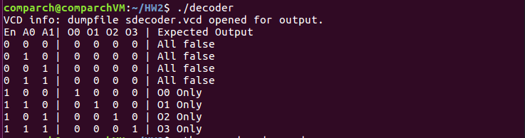
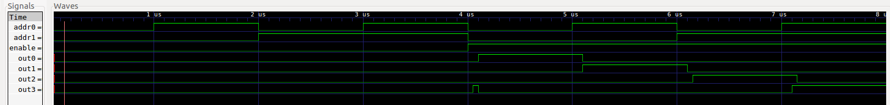
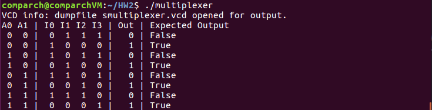
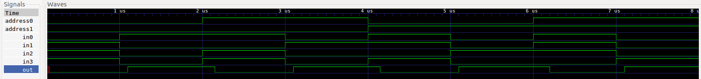
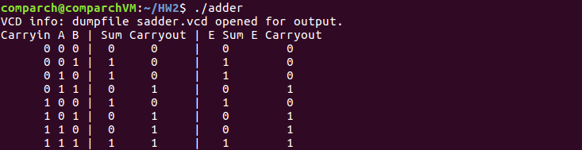
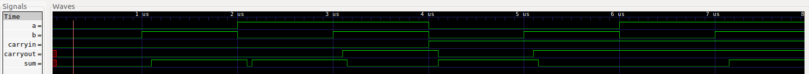

# HW2 Writeup

Note - I don't have files with the commands I used to run tests, so I'll include them here.

## Decoder

Run:
```bash
$ iverilog -o decoder decoder.t.v
$ ./decoder
```

Result:



Run:
```bash
$ gtkwave sdecoder.vcd
```

Result (after some dragging):



## Multiplexer

Run:
```bash
$ iverilog -o multiplexer multiplexer.t.v
$ ./multiplexer
```

Result:



Run:
```bash
$ gtkwave smultiplexer.vcd
```

Result (after some dragging):



## Adder

Run:
```bash
$ iverilog -o adder adder.t.v
$ ./adder
```

Result:



Run:
```bash
$ gtkwave sadder.vcd
```

Result (after some dragging):


